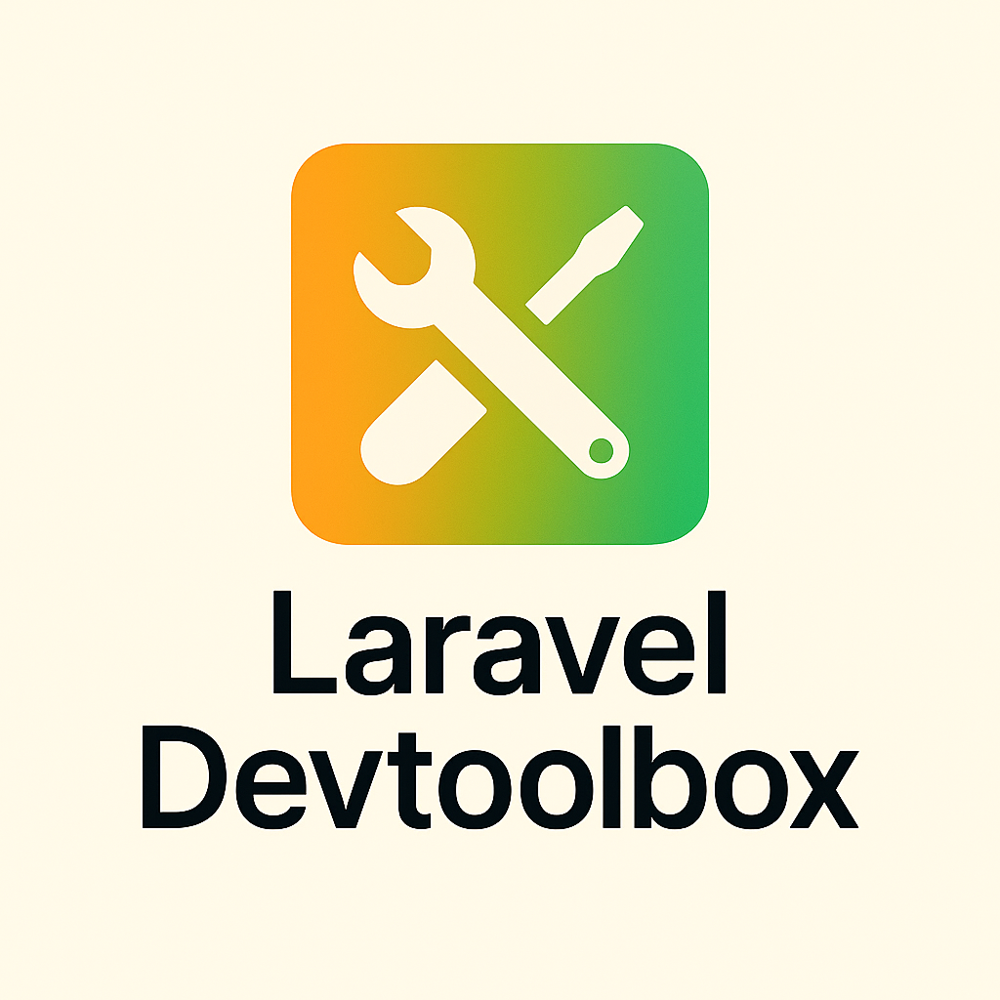

# Laravel Devtoolbox



Swiss-army artisan CLI for Laravel — Scan, inspect, debug, and explore every aspect of your Laravel application from the command line.

[](https://packagist.org/packages/grazulex/laravel-devtoolbox)
[](https://packagist.org/packages/grazulex/laravel-devtoolbox)
[](https://github.com/Grazulex/laravel-devtoolbox/blob/main/LICENSE.md)
[](https://php.net/)
[](https://laravel.com/)
[](https://github.com/Grazulex/laravel-devtoolbox/actions)
[](https://github.com/laravel/pint)


## ✨ Features

Laravel Devtoolbox provides comprehensive analysis tools for Laravel applications:

- **🔎 Deep Application Scanning** - Complete analysis of models, routes, services, and more
- **🧠 Model Introspection** - Analyze Eloquent models, relationships, and usage patterns
- **🛣️ Route Analysis** - Inspect routes, detect unused ones, and analyze middleware
- **📦 Service Container Analysis** - Examine bindings, singletons, and providers
- **⚙️ Environment Auditing** - Compare configuration files and detect inconsistencies
- **🔄 SQL Query Tracing** - Monitor and analyze database queries for specific routes
- **📊 Multiple Export Formats** - JSON, Markdown, Mermaid diagrams, and more
- **🛠 Developer Experience** - Rich console output with actionable insights

## 📦 Installation

Install via Composer as a development dependency:

```bash
composer require --dev grazulex/laravel-devtoolbox
```

**Requirements:**
- PHP 8.3+
- Laravel 11.0+ | 12.0+

## 🚀 Quick Start

```bash
# See all available commands
php artisan list dev:

# Enhanced application overview (new!)
php artisan dev:about+ --extended --performance

# Quick health check of your application
php artisan dev:scan --all

# Find where a model is used
php artisan dev:model:where-used App\Models\User

# Detect unused routes
php artisan dev:routes:unused

# Find routes by controller (reverse lookup - new!)
php artisan dev:routes:where UserController

# Generate model relationship diagram
php artisan dev:model:graph --format=mermaid --output=models.mmd

# Trace SQL queries for a route
php artisan dev:sql:trace --route=dashboard

# Analyze SQL queries for N+1 problems (new!)
php artisan dev:sql:duplicates --route=users.index --threshold=3

# Monitor logs in real-time (new!)
php artisan dev:log:tail --follow --level=error

# Compare environment files
php artisan dev:env:diff --against=.env.example

# Analyze database column usage
php artisan dev:db:column-usage --unused-only

# Security scan for unprotected routes
php artisan dev:security:unprotected-routes --critical-only

# Analyze container bindings (new!)
php artisan dev:container:bindings --show-resolved

# Service provider performance analysis (new!)
php artisan dev:providers:timeline --slow-threshold=100

# Performance monitoring (new!)
php artisan dev:performance:memory --route=dashboard
php artisan dev:performance:slow-queries --threshold=1000
php artisan dev:cache:analysis --drivers=redis,file
php artisan dev:queue:analysis --failed-jobs --slow-jobs
```

## 🔍 Available Commands

### General Scanning & Analysis
- `dev:scan` - Comprehensive application analysis with multiple scanner types
- `dev:about+` - Enhanced version of Laravel's about command with extended information

### Model Analysis
- `dev:models` - List and analyze all Eloquent models
- `dev:model:where-used` - Find where specific models are used
- `dev:model:graph` - Generate model relationship diagrams

### Route Analysis  
- `dev:routes` - Inspect application routes
- `dev:routes:unused` - Detect potentially unused routes
- `dev:routes:where` - Find routes by controller/method (reverse lookup)

### Database Analysis
- `dev:db:column-usage` - Analyze database column usage across the Laravel application codebase
- `dev:sql:trace` - Trace SQL queries for specific routes
- `dev:sql:duplicates` - Analyze SQL queries for N+1 problems, duplicates, and performance issues

### Security Analysis
- `dev:security:unprotected-routes` - Scan for routes that are not protected by authentication middleware

### Service & Container Analysis
- `dev:services` - Examine service container bindings
- `dev:container:bindings` - Analyze container bindings, singletons, and dependency injection mappings
- `dev:providers:timeline` - Analyze service provider boot timeline and performance
- `dev:commands` - List and analyze artisan commands

### Middleware Analysis
- `dev:middleware` - Analyze middleware classes and usage
- `dev:middlewares:where-used` - Find where specific middleware is used

### View Analysis
- `dev:views` - Scan Blade templates and views

### Environment & Logging
- `dev:env:diff` - Compare environment configuration files
- `dev:log:tail` - Monitor Laravel logs with real-time filtering and pattern matching

### Performance Analysis (new!)
- `dev:performance:memory` - Analyze memory usage patterns and performance
- `dev:performance:slow-queries` - Detect and analyze slow database queries
- `dev:cache:analysis` - Analyze cache performance and configuration
- `dev:queue:analysis` - Analyze queue performance, failed jobs, and job patterns

## 📊 Export Formats

All commands support multiple output formats:

| Format | Usage | Best For |
|--------|-------|----------|
| **Array/Table** | `--format=array` (default) | Interactive development |
| **JSON** | `--format=json` | Automation, CI/CD |
| **Count** | `--format=count` | Quick metrics |
| **Mermaid** | `--format=mermaid` | Documentation, diagrams |

### Save to Files

```bash
# Export to JSON
php artisan dev:models --format=json --output=models.json

# Generate Mermaid diagram
php artisan dev:model:graph --format=mermaid --output=relationships.mmd

# Save comprehensive scan
php artisan dev:scan --all --format=json --output=app-analysis.json
```

## 🛠 Configuration

Publish the configuration file to customize behavior:

```bash
php artisan vendor:publish --tag=devtoolbox-config
```

This creates `config/devtoolbox.php` where you can customize:
- Default output formats
- Scanner-specific options
- Performance settings
- Export configurations

## 📚 Documentation

Comprehensive documentation and examples are available in our **[GitHub Wiki](https://github.com/Grazulex/laravel-devtoolbox/wiki)**:

- **[Getting Started](https://github.com/Grazulex/laravel-devtoolbox/wiki/Getting-Started)** - Quick start guide
- **[Commands Reference](https://github.com/Grazulex/laravel-devtoolbox/wiki/Commands)** - Detailed command documentation  
- **[Configuration](https://github.com/Grazulex/laravel-devtoolbox/wiki/Configuration)** - Configuration options
- **[Examples & Use Cases](https://github.com/Grazulex/laravel-devtoolbox/wiki/Examples)** - Practical usage examples
- **[CI/CD Integration](https://github.com/Grazulex/laravel-devtoolbox/wiki/CI-CD)** - Automation workflows
- **[Output Formats](https://github.com/Grazulex/laravel-devtoolbox/wiki/Output-Formats)** - Export format examples

## 🔧 Examples & Automation

### Daily Development Workflow

```bash
# Check application health
php artisan dev:scan --all --format=count

# Find cleanup opportunities
php artisan dev:routes:unused
php artisan dev:env:diff
```

### CI/CD Integration

```bash
# Quality gates in CI
UNUSED_ROUTES=$(php artisan dev:routes:unused --format=count | jq '.count')
if [ $UNUSED_ROUTES -gt 10 ]; then
  echo "Too many unused routes: $UNUSED_ROUTES"
  exit 1
fi
```

### Documentation Generation

```bash
# Generate project documentation
php artisan dev:models --format=json --output=docs/models.json
php artisan dev:model:graph --format=mermaid --output=docs/relationships.mmd
php artisan dev:routes --format=json --output=docs/routes.json
```

For complete automation scripts and CI/CD configurations, visit our **[Wiki Examples](https://github.com/Grazulex/laravel-devtoolbox/wiki/Examples)**.

## 🔍 Use Cases

- **🔍 Code Reviews** - Generate comprehensive application overviews
- **📊 Performance Analysis** - Identify slow queries and bottlenecks  
- **🧹 Technical Debt** - Find unused routes, orphaned models, and inconsistencies
- **📖 Documentation** - Auto-generate up-to-date application structure docs
- **⚡ CI/CD Quality Gates** - Automated quality checks and thresholds
- **🎯 Onboarding** - Help new team members understand application structure

## 🆕 Version Compatibility

| Laravel Devtoolbox | PHP Version | Laravel Version | Status |
|-------------------|-------------|-----------------|---------|
| 1.x              | 8.3+        | 11.x \| 12.x   | ✅ Active |

> **Note:** This package now fully supports both Laravel 11 and Laravel 12, ensuring compatibility across the latest LTS and current releases.

## 🤝 Contributing

We welcome contributions! Please see our [Contributing Guide](CONTRIBUTING.md) for details.

## 📄 License

Laravel Devtoolbox is open-sourced software licensed under the [MIT license](LICENSE.md).

---

<div align="center">
  <p>Made with ❤️ for the Laravel community</p>
  <p>
    <a href="https://github.com/grazulex/laravel-devtoolbox/issues">Report Issues</a> •
    <a href="https://github.com/grazulex/laravel-devtoolbox/discussions">Discussions</a> •
    <a href="https://github.com/grazulex/laravel-devtoolbox/wiki">Wiki</a>
  </p>
</div>
